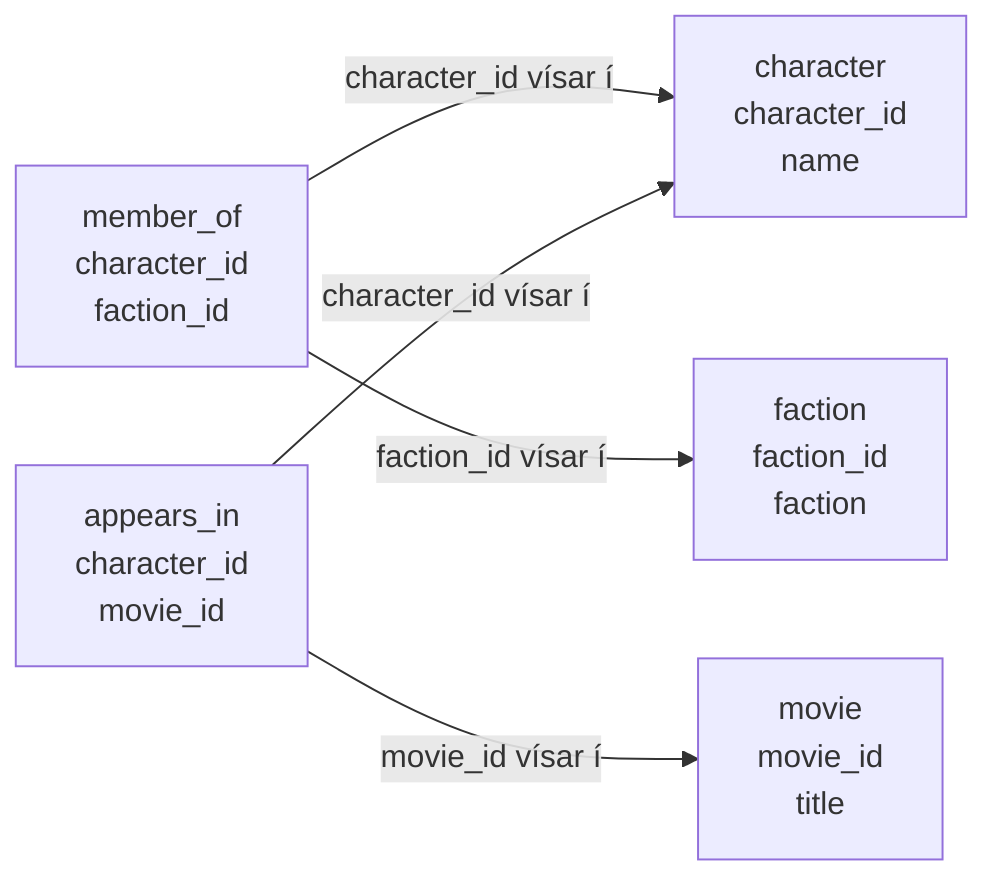

Vensl lýsa sambandi milli hluta. Í þessu dæmi höfum við meðal annars þessi mengi:

- persónur,
- lið,
- kvikmyndir.

Í innganginum geymdum við persónur í `character`, lið í `faction` og kvikmyndir í `movie`. Síðan
notuðum við tvær tengitöflur:

- `member_of` segir hvaða persóna tengist hvaða liði,
- `appears_in` segir hvaða persóna tengist hvaða mynd.

## Dæmi: persóna tengist liði

Taflan `member_of` lýsir sambandi milli persóna og liða. Hver röð er par af auðkennum:

| character_id | faction_id |
|---:|---:|
| 1 | 100 |
| 1 | 300 |
| 2 | 100 |
| 3 | 100 |
| 4 | 200 |
| 4 | 300 |
| 5 | 300 |
| 6 | 100 |
| 7 | 400 |
| 7 | 500 |
| 8 | 600 |

Röðin `(1, 100)` segir að persóna 1 tengist liði 100 með venslinu „er í“. Til að lesa hana flettum
við upp `character_id = 1` í `character` og `faction_id = 100` í `faction`. Þá fáum við: Luke er í
Rebel Alliance.

Þetta má lesa sem:

$$
member\_of \subseteq character \times faction
$$

Það þýðir að `member_of` er safn af pörum þar sem fyrra stakið kemur úr hópi persóna og seinna
stakið úr hópi liða.

## Dæmi: persóna tengist kvikmynd

Taflan `appears_in` lýsir sambandi milli persóna og kvikmynda:

| character_id | movie_id |
|---:|---:|
| 1 | 10 |
| 1 | 20 |
| 1 | 30 |
| 2 | 10 |
| 2 | 20 |
| 2 | 30 |
| 3 | 10 |
| 3 | 20 |
| 3 | 30 |
| 4 | 10 |
| 4 | 20 |
| 4 | 30 |
| 5 | 20 |
| 5 | 30 |
| 6 | 10 |
| 6 | 20 |
| 6 | 30 |
| 7 | 40 |
| 8 | 20 |
| 8 | 30 |

Röðin `(7, 40)` segir að persóna 7 tengist mynd 40 með venslinu „birtist í“. Þegar við flettum upp
auðkennunum sjáum við: Finn birtist í `The Force Awakens`.

Þetta má lesa sem:

$$
appears\_in \subseteq character \times movie
$$

## Hvernig lítur þetta út?

Sambandið milli taflnanna má teikna svona:

Ein persóna getur tengst mörgum röðum í `member_of`, því sama persóna getur verið í fleiri en einu
liði. Finn getur til dæmis tengst bæði First Order og Resistance. Boba Fett tengist hins vegar
Bounty Hunters og er hvorki skráður í Rebel Alliance né Galactic Empire. Ein persóna getur líka
tengst mörgum röðum í `appears_in`, því sama persóna getur birst í mörgum myndum.

## Af hverju margar litlar töflur?

Ef við skrifum nafnið `Rebel Alliance` í hverja einustu röð þar sem liðið kemur fyrir, þurfum við að
laga margar línur ef nafnið er rangt stafsett. Ef liðið er geymt einu sinni í `faction` þurfum við
bara að laga eina línu.

Þetta er hugmyndin á bak við normaliseringu í venslagagnasöfnum. Codd setti fram reglur um hvernig
mætti skipuleggja töflur til að minnka endurtekningar og koma í veg fyrir mótsagnir í gögnum.
[Þriðja normal form](https://en.wikipedia.org/wiki/Third_normal_form) er oft munað með reglunni að
hver dálkur eigi að lýsa lyklinum, öllum lyklinum og engu nema lyklinum.

Í okkar litla dæmi þýðir það:

- `name` lýsir `character_id`, svo það á heima í `character`.
- `faction` lýsir `faction_id`, svo það á heima í `faction`.
- `title` lýsir `movie_id`, svo það á heima í `movie`.
- sambandið „er í“ er ekki eiginleiki persónunnar eða liðsins einnar og sér, svo það á heima í
  `member_of`.
- sambandið „birtist í“ er ekki eiginleiki persónunnar eða myndarinnar einnar og sér, svo það á
  heima í `appears_in`.

Boyce-Codd normal form, stundum kallað BCNF eða 3.5NF, er strangari útgáfa af sömu hugsun. Við
þurfum ekki að kunna formlegu regluna hér. Fyrir okkar markmið dugar að spyrja:

> Er þessi staðreynd geymd á einum skynsamlegum stað?

## Af hverju skiptir þetta máli fyrir SQL?

SQL vinnur með töflur. Ef við getum lesið töflu sem safn fullyrðinga verður auðveldara að skrifa
fyrirspurnir.

Í stað þess að hugsa:

> Ég þarf að skrifa kóða sem leitar í gegnum allt.

getum við hugsað:

> Ég vil þær raðir þar sem fullyrðingin er sönn.

Þetta er kjarninn í `WHERE`.

Seinna, þegar við lærum `JOIN`, notum við sömu hugsun til að tengja töflur saman. Hér þurfum við
bara að sjá að tafla getur táknað samband.
