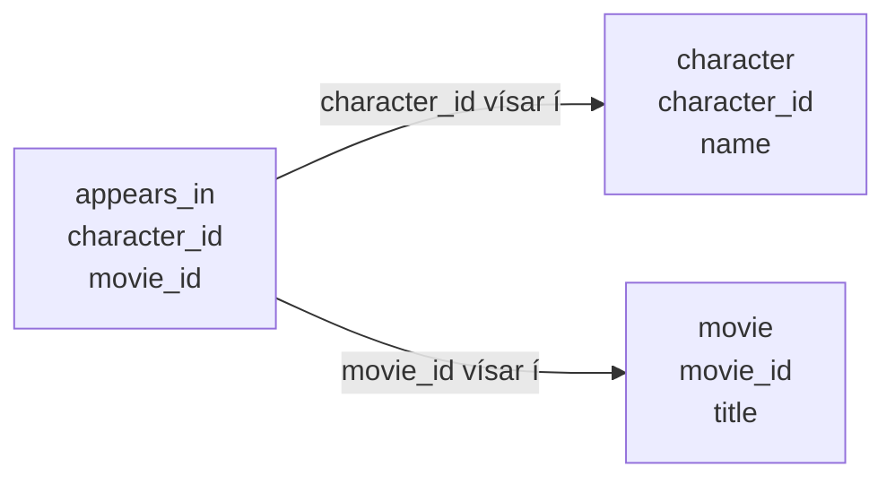

Vensl lýsa sambandi milli hluta. Í þessu dæmi eru tvö mengi:

- persónur,
- kvikmyndir.

Við geymum persónur á einum stað:

| character_id | name |
|---:|---|
| 1 | Luke |
| 2 | Leia |
| 3 | Han |
| 4 | Darth Vader |
| 5 | Yoda |
| 6 | Chewbacca |

Við geymum kvikmyndir á einum stað:

| movie_id | title |
|---:|---|
| 10 | A New Hope |
| 20 | The Empire Strikes Back |
| 30 | Return of the Jedi |

Taflan `appears_in` lýsir svo sambandinu milli þeirra. Hver röð er par af auðkennum:

| character_id | movie_id |
|---:|---:|
| 1 | 10 |
| 1 | 20 |
| 1 | 30 |
| 2 | 10 |
| 2 | 20 |
| 2 | 30 |
| 3 | 10 |
| 3 | 20 |
| 3 | 30 |
| 4 | 10 |
| 4 | 20 |
| 4 | 30 |
| 5 | 20 |
| 5 | 30 |
| 6 | 10 |
| 6 | 20 |
| 6 | 30 |

Röðin `(1, 10)` segir að persóna 1 tengist mynd 10 með venslinu „birtist í“. Til að lesa hana
flettum við upp `character_id = 1` í `character` og `movie_id = 10` í `movie`. Þá fáum við: Luke
birtist í `A New Hope`.

Þetta má lesa sem:

$$
appears\_in \subseteq character \times movie
$$

Það þýðir að `appears_in` er safn af pörum þar sem fyrra stakið kemur úr hópi persóna og seinna
stakið úr hópi kvikmynda.

## Hvernig lítur þetta út?

Sambandið milli taflnanna má teikna svona:

Ein röð í `character` getur tengst mörgum röðum í `appears_in`, því sama persóna getur birst í
mörgum myndum. Ein röð í `movie` getur líka tengst mörgum röðum í `appears_in`, því sama mynd getur
haft margar persónur.

## Af hverju margar litlar töflur?

Ef við skrifum nafnið `The Empire Strikes Back` í hverja einustu röð þar sem myndin kemur fyrir,
þurfum við að laga margar línur ef titillinn er rangt stafsettur. Ef myndin er geymd einu sinni í
`movie` þurfum við bara að laga eina línu.

Þetta er hugmyndin á bak við normaliseringu í venslagagnasöfnum. Codd setti fram reglur um hvernig
mætti skipuleggja töflur til að minnka endurtekningar og koma í veg fyrir mótsagnir í gögnum.
[Þriðja normal form](https://en.wikipedia.org/wiki/Third_normal_form) er oft munað með reglunni að
hver dálkur eigi að lýsa lyklinum, öllum lyklinum og engu nema lyklinum.

Í okkar litla dæmi þýðir það:

- `name` lýsir `character_id`, svo það á heima í `character`.
- `title` lýsir `movie_id`, svo það á heima í `movie`.
- sambandið „birtist í“ er ekki eiginleiki persónunnar eða myndarinnar einnar og sér, svo það á
  heima í `appears_in`.

Boyce-Codd normal form, stundum kallað BCNF eða 3.5NF, er strangari útgáfa af sömu hugsun. Við
þurfum ekki að kunna formlegu regluna hér. Fyrir okkar markmið dugar að spyrja:

> Er þessi staðreynd geymd á einum skynsamlegum stað?

## Af hverju skiptir þetta máli fyrir SQL?

SQL vinnur með töflur. Ef við getum lesið töflu sem safn fullyrðinga verður auðveldara að skrifa
fyrirspurnir.

Í stað þess að hugsa:

> Ég þarf að skrifa kóða sem leitar í gegnum allt.

getum við hugsað:

> Ég vil þær raðir þar sem fullyrðingin er sönn.

Þetta er kjarninn í `WHERE`.

## Sama hlutur getur tengst mörgu

Vensl þurfa ekki að vera eitt-á-eitt. Luke getur birst í fleiri en einni mynd, og sama mynd getur
haft fleiri en eina persónu.

Það er ein ástæða fyrir því að töflur henta vel fyrir gögn. Þær leyfa mörg pör:

- Luke tengist `A New Hope`,
- Luke tengist `The Empire Strikes Back`,
- Yoda tengist `The Empire Strikes Back`,
- Yoda tengist `Return of the Jedi`.

Seinna, þegar við lærum `JOIN`, notum við sömu hugsun til að tengja töflur saman. Hér þurfum við
bara að sjá að tafla getur táknað samband.
