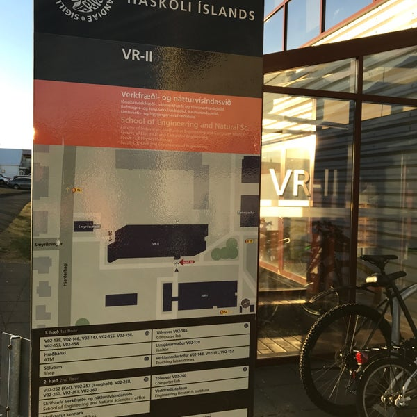

## {.title-slide .center}

<div class="title-content subtitle-below">
<span class="subtitle-highlight">Upplýsingaverkfræði</span>
<span class="title-theme">IÐN302G · Haust 2026</span>
</div>

<div class="title-meta">Kynning á námskeiðinu, fyrirkomulagi og verkefnavinnu</div>

---

## Hvað er upplýsingaverkfræði? {.section-break}

<span class="kicker">Lyfturæða</span>

Upplýsingaverkfræði er verkfærakista til að breyta hráum gögnum í verðmæta innsýn.

::: {.callout}
Markmiðið er ekki bara að vinna með gögn — heldur að gera þau gagnleg fyrir ákvarðanir.
:::

---

## Af hverju skiptir þetta máli?

::: {.card-grid}

::: {.card}
<h3>Gögn vaxa hratt</h3>

Stofnanir, fyrirtæki og samfélög safna sífellt meiri gögnum.
:::

::: {.card}
<h3>Skipulag skapar innsýn</h3>

Gagnavinna snýst um að finna mynstur, frávik, tengsl og þróun.
:::

::: {.card}
<h3>Innsýn styður ákvarðanir</h3>

Vel unnin gögn geta bætt stefnumótun, rekstur, rannsóknir og miðlun.
:::

:::

---

## Upplýsingaverkfræði og iðnaðarverkfræði

::: {.card-grid}

::: {.card}
<h3>Iðnaðarverkfræði</h3>

- bestar ferli og kerfi
- skoðar flæði, gæði og ákvarðanir
- vinnur með fólk, tækni og rekstur
:::

::: {.card}
<h3>Upplýsingaverkfræði</h3>

- gerir gögn aðgengileg og rekjanleg
- styður gagnadrifnar ákvarðanir
- tengir tæknilega vinnu við raunverulegt virði
:::

:::

---

## Grundvallarhugtök

::: {.card-grid}

::: {.card}
<h3>Mynstur</h3>

Endurtekin hegðun í gögnum.
:::

::: {.card}
<h3>Stefna</h3>

Þróun yfir tíma.
:::

::: {.card}
<h3>Tengsl</h3>

Sambönd sem varpa ljósi á samhengi.
:::

::: {.card}
<h3>Frávik</h3>

Atvik sem passa ekki við væntingar.
:::

::: {.card}
<h3>Skorður</h3>

Reglur sem halda gögnum heilum og merkingarbærum.
:::

::: {.card}
<h3>Gagnasaga</h3>

Frásögn sem hjálpar öðrum að skilja niðurstöður.
:::

:::

---

## Frá gögnum til virðis

<div class="steps-row value-chain" style="--steps-count: 6;">
  <div class="step-chip"><strong>Gögn</strong><span>Hrágögn, skrár, API, gagnagrunnar.</span></div>
  <div class="step-chip"><strong>Upplýsingar</strong><span>Hreinsun, tengingar, töflur og gröf.</span></div>
  <div class="step-chip"><strong>Þekking</strong><span>Áhorfandi greinir og túlkar.</span></div>
  <div class="step-chip"><strong>Ákvörðun</strong><span>Niðurstöður nýttar til að velja leið.</span></div>
  <div class="step-chip"><strong>Framkvæmd</strong><span>Breyting gerð í rekstri eða verkefni.</span></div>
  <div class="step-chip"><strong>Virði</strong><span>Ávinningur verður sýnilegur.</span></div>
</div>

---

## Frá gögnum til virðis: Gögn

<div class="steps-row value-chain focus-1" style="--steps-count: 6;">
  <div class="step-chip"><strong>Gögn</strong></div>
  <div class="step-chip"><strong>Upplýsingar</strong></div>
  <div class="step-chip"><strong>Þekking</strong></div>
  <div class="step-chip"><strong>Ákvörðun</strong></div>
  <div class="step-chip"><strong>Framkvæmd</strong></div>
  <div class="step-chip"><strong>Virði</strong></div>
</div>

::: {.value-detail}
- Ná í hrágögn frá gagnaþjónustum, gagnagrunnum, API eða skrám.
- Meðhöndla gögnin: hreinsa, tengja saman, samræma og staðfesta.
- Þetta er oft tímafrekasti hluti gagnaverkefnisins.
:::

---

## Frá gögnum til virðis: Upplýsingar

<div class="steps-row value-chain focus-2" style="--steps-count: 6;">
  <div class="step-chip"><strong>Gögn</strong></div>
  <div class="step-chip"><strong>Upplýsingar</strong></div>
  <div class="step-chip"><strong>Þekking</strong></div>
  <div class="step-chip"><strong>Ákvörðun</strong></div>
  <div class="step-chip"><strong>Framkvæmd</strong></div>
  <div class="step-chip"><strong>Virði</strong></div>
</div>

::: {.value-detail}
- Búa til upplýsingar úr gögnunum með greiningu, fyrirspurnum og úrvinnslu.
- Setja niðurstöður fram með töflum, gröfum, texta, skýrslum eða mælaborðum.
- Upplýsingar þurfa að vera aðgengilegar fyrir þann sem á að nota þær.
:::

---

## Frá gögnum til virðis: Þekking

<div class="steps-row value-chain focus-3" style="--steps-count: 6;">
  <div class="step-chip"><strong>Gögn</strong></div>
  <div class="step-chip"><strong>Upplýsingar</strong></div>
  <div class="step-chip"><strong>Þekking</strong></div>
  <div class="step-chip"><strong>Ákvörðun</strong></div>
  <div class="step-chip"><strong>Framkvæmd</strong></div>
  <div class="step-chip"><strong>Virði</strong></div>
</div>

::: {.value-detail}
Áhorfandi greinir, rýnir og túlkar upplýsingarnar. Þekking verður til þegar einhver skilur
hvað gögnin segja og hvers vegna það skiptir máli.
:::

---

## Frá gögnum til virðis: Ákvörðun

<div class="steps-row value-chain focus-4" style="--steps-count: 6;">
  <div class="step-chip"><strong>Gögn</strong></div>
  <div class="step-chip"><strong>Upplýsingar</strong></div>
  <div class="step-chip"><strong>Þekking</strong></div>
  <div class="step-chip"><strong>Ákvörðun</strong></div>
  <div class="step-chip"><strong>Framkvæmd</strong></div>
  <div class="step-chip"><strong>Virði</strong></div>
</div>

::: {.value-detail}
Upplýst ákvörðun er tekin út frá gögnunum, til dæmis breyting á rekstri, forgangsröðun,
stefnumótun eða næsta skref í verkefni.
:::

---

## Frá gögnum til virðis: Framkvæmd

<div class="steps-row value-chain focus-5" style="--steps-count: 6;">
  <div class="step-chip"><strong>Gögn</strong></div>
  <div class="step-chip"><strong>Upplýsingar</strong></div>
  <div class="step-chip"><strong>Þekking</strong></div>
  <div class="step-chip"><strong>Ákvörðun</strong></div>
  <div class="step-chip"><strong>Framkvæmd</strong></div>
  <div class="step-chip"><strong>Virði</strong></div>
</div>

::: {.value-detail}
Breytingin er framkvæmd. Þetta getur verið breyting á ferli, kerfi, vöru, stefnu eða því
hvernig upplýsingar eru notaðar í daglegu starfi.
:::

---

## Frá gögnum til virðis: Virði

<div class="steps-row value-chain focus-6" style="--steps-count: 6;">
  <div class="step-chip"><strong>Gögn</strong></div>
  <div class="step-chip"><strong>Upplýsingar</strong></div>
  <div class="step-chip"><strong>Þekking</strong></div>
  <div class="step-chip"><strong>Ákvörðun</strong></div>
  <div class="step-chip"><strong>Framkvæmd</strong></div>
  <div class="step-chip"><strong>Virði</strong></div>
</div>

::: {.value-detail}
Virði skapast þegar vinnan hefur raunveruleg áhrif: betri ákvarðanir, skýrari yfirsýn,
minni sóun, meiri gæði eða nýr skilningur.
:::

---

## Hvað gerum við í námskeiðinu?

<div class="steps-row value-chain course-focus" style="--steps-count: 6;">
  <div class="step-chip"><strong>Gögn</strong></div>
  <div class="step-chip"><strong>Upplýsingar</strong></div>
  <div class="step-chip"><strong>Þekking</strong></div>
  <div class="step-chip"><strong>Ákvörðun</strong></div>
  <div class="step-chip"><strong>Framkvæmd</strong></div>
  <div class="step-chip"><strong>Virði</strong></div>
</div>

::: {.value-detail}
Í námskeiðinu fáist þið við þetta ferli með raunverkefni: þið safnið gögnum,
komið upplýsingunum á skynsamlegt form, greinið gögnin og deilið niðurstöðum.
:::

---

## Grunnur sem nýtist víða

::: {.card-grid}

::: {.card}
<h3>Skipulag og innsýn</h3>

Upplýsingaverkfræði hjálpar til við að koma skipulagi á gögn og draga fram mikilvægar upplýsingar.
:::

::: {.card}
<h3>Viðskiptagreind</h3>

Gagnagreining nýtist til að bæta stefnumótun og ákvarðanatöku í fyrirtækjum og stofnunum.
:::

::: {.card}
<h3>Næsta skref</h3>

IÐN302G er inngangskúrs. Í IÐN610M Viðskiptagreind er virðiskeðjan tekin lengra með virkri þátttöku fyrirtækis.
:::

:::

---

## Að kanna vs. að útskýra

::: {.card-grid}

::: {.card}
<h3>Exploratory analysis</h3>
<h2>Að kanna</h2>

- spyrja: *hvað er í gögnunum?*
- leita að mynstrum og frávikum
- prófa margar leiðir
- halda túlkunum opnum
:::

::: {.card}
<h3>Explanatory analysis</h3>
<h2>Að útskýra</h2>

- spyrja: *hvað þurfa aðrir að skilja?*
- velja skýra frásögn
- styðja niðurstöðu með gögnum
- leiða lesanda að ákvörðun
:::

:::

---

## Gagnasögur

Gagnasaga er ekki bara fallegt graf. Hún tengir saman spurningu, gögn, greiningu og niðurstöðu.

::: {.card-grid}

::: {.card}
<h3>Skýr miðlun</h3>

Flókin gögn verða skiljanleg.
:::

::: {.card}
<h3>Samhengi</h3>

Lesandi sér af hverju niðurstaðan skiptir máli.
:::

::: {.card}
<h3>Áhrif</h3>

Niðurstaðan hjálpar fólki að bregðast við.
:::

:::

---

## Hæfni sem nýtist í atvinnulífi

::: {.card-grid}

::: {.card}
<h3>SQL</h3>

Grunnfærni í gagnavinnslu og fyrirspurnum.
:::

::: {.card}
<h3>Forritun</h3>

Python, R eða önnur tól til að hreinsa, greina og endurtaka vinnu.
:::

::: {.card}
<h3>Myndræn framsetning</h3>

Gröf, töflur, kort og mælaborð.
:::

::: {.card}
<h3>GitHub</h3>

Útgáfustjórnun, samvinna, issues, PR og kóðarýni.
:::

::: {.card}
<h3>Erindrekar</h3>

AI sem aðstoð við kóða, texta, villuleit og rýni.
:::

::: {.card}
<h3>Dómgreind</h3>

Að vita hvað má treysta, hvað þarf að prófa og hvað þarf að útskýra.
:::

:::

---

## Þrjú meginþemu námskeiðsins

::: {.card-grid}

::: {.card}
<h3>Endurtakanlegt vinnuflæði</h3>

Gögn, kóði og skýrsla eiga að hanga saman þannig að hægt sé að endurskapa niðurstöður.
:::

::: {.card}
<h3>Samvinna í GitHub</h3>

Issues, branches, Pull Requests, review og releases halda utan um vinnuna.
:::

::: {.card}
<h3>Dómgreind með erindreka</h3>

AI getur hjálpað, en teymið ber ábyrgð á að skilja, prófa og rýna niðurstöðuna.
:::

:::

---

## Námskeiðsskipulag

::: {.card-grid .numbered}

::: {.card}
<h3>Git, erindrekar og endurtækar skýrslur</h3>

Vinnuflæði, GitHub og skýrslur sem hægt er að keyra aftur.
:::

::: {.card}
<h3>Vefþjónustur og reglulegar segðir</h3>

Sækja gögn frá vefþjónustum og API-um; leit, mynstragreining og vinnsla textagagna.
:::

::: {.card}
<h3>Rökfræði og mengi</h3>

Undirstaða skilyrða, vensla og SQL JOIN.
:::

::: {.card}
<h3>SQL grunnatriði</h3>

Töflur, fyrirspurnir, flokkun, samlagning og NULL.
:::

::: {.card}
<h3>SQL framhald</h3>

JOIN, CTE, views, föll, PostgreSQL og PostGIS.
:::

::: {.card}
<h3>Myndræn framsetning</h3>

Gagnafrásögn, gröf, kort og mælaborð.
:::

::: {.card .accent}
<h3>Samþætting</h3>

Ekki ný aðferð — hér er fínpússað og ítrað á fyrri lotur og allt tengt saman í heildstæða gagnasögu fyrir capstone.
:::

:::

---

## Taktur hverrar lotu

<div class="steps-row lota-flow" style="--steps-count: 5;">
  <div class="step-chip"><strong>iPREP</strong><span>Einstaklingsundirbúningur heima.</span></div>
  <div class="step-chip"><strong>iRAT/tRAT</strong><span>Fyrst einstaklingspróf, síðan teymispróf.</span></div>
  <div class="step-chip"><strong>tAPP</strong><span>Teymið beitir aðferð lotunnar á eigið verkefni.</span></div>
  <div class="step-chip"><strong>iREF</strong><span>Stutt einstaklingsígrundun.</span></div>
  <div class="step-chip"><strong>iTA/Q&A</strong><span>Eftirfylgni og spurningar um ákvarðanir hópsins.</span></div>
</div>

---

## GitHub vinnuflæðið

<div class="steps-row value-chain" style="--steps-count: 6;">
  <div class="step-chip"><strong>Issue</strong><span>Skilgreina verkefnið, ræða nálgun og gera aðgerðaáætlun áður en vinna hefst.</span></div>
  <div class="step-chip"><strong>Branch</strong><span>Afmörkuð virkni útfærð á sérgrein, aðskilin frá <code>main</code>.</span></div>
  <div class="step-chip"><strong>draft PR</strong><span>Eigin yfirferð og fyrstu drög sett fram til umræðu.</span></div>
  <div class="step-chip"><strong>PR</strong><span>Hópmeðlimir rýna, spyrja spurninga og gefa endurgjöf.</span></div>
  <div class="step-chip"><strong>Merge</strong><span>Breytingar samþykktar og sameinaðar inn á aðalgrein (<code>main</code>).</span></div>
  <div class="step-chip"><strong>Release</strong><span>Nokkur PR komin inn á aðalgrein; áfangi merktur sem útgáfa.</span></div>
</div>

::: {.callout}
PR á að vera nógu lítið til að hægt sé að rýna það vel.
:::

::: {.callout}
Ef breytingin er orðin of víðfeðm er það merki um að skipta henni upp.
:::

---

## Capstone verkefni

Capstone verkefnið er þráðurinn í gegnum misserið.

::: {.card-grid}

::: {.card}
<h3>Þið veljið þema</h3>

- opin gögn
- spurning sem skiptir máli
- afmörkuð nálgun
- lifandi GitHub Pages síða
:::

::: {.card}
<h3>Þið byggið upp verkefnið</h3>

- gögn og hreinsun
- fyrirspurnir og greining
- myndræn framsetning
- frásögn og rökstuðningur
:::

:::

---

## Hvað skilar hver lota inn í capstone?

::: {.card-grid}

::: {.card}
<h3>Ný aðferð</h3>

Teymið prófar aðferð lotunnar á eigin gögnum.
:::

::: {.card}
<h3>Nýr skilningur</h3>

Hvað lærðum við um gögnin, spurninguna eða vinnulagið?
:::

::: {.card}
<h3>Ný sönnunargögn</h3>

PR, commit saga, síða, ígrundun og release sýna vinnuna.
:::

:::

---

## Námsmat: hvað er verið að meta?

::: {.card-grid}

::: {.card}
<h3>Undirbúningur</h3>

Að þið mætið með grunnskilning á efni lotunnar.
:::

::: {.card}
<h3>Teymisvinna</h3>

Að hópurinn vinni skipulega, sýnilega og með kóðarýni.
:::

::: {.card}
<h3>Beiting aðferða</h3>

Að aðferðir námskeiðsins séu notaðar á eigið verkefni.
:::

::: {.card}
<h3>Ígrundun</h3>

Að hver nemandi geti útskýrt eigin lærdóm og framlag.
:::

::: {.card}
<h3>Samþætting</h3>

Að lokaverkefnið segi heildstæða gagnasögu.
:::

::: {.card}
<h3>Rekjanleiki</h3>

Að vinnan sé sýnileg í GitHub og hægt sé að fylgja þróuninni.
:::

:::

---

## Verkfærin

::: {.card-grid}

::: {.card}
<h3>Námsefni og skil</h3>

- námskeiðsbók í Quarto
- Canvas fyrir formleg skil
- GitHub Pages fyrir birtingu
:::

::: {.card}
<h3>Vinna og samvinna</h3>

- GitHub repo
- Issues og Projects
- branches og Pull Requests
- kóðarýni og releases
:::

:::

---

## Fyrstu skref

1. Velja Capstone þema og mynda 3ja manna teymi
2. Staðfesta GitHub-aðgang.
3. Setja upp Git á eigin vélum.
4. Setja upp SSH lykil
5. Klóna æfingasvæði (einstaklings og teymis) og prófa sig áfram.

::: {.callout}
Við erum að æfa vinnulagið sem þið eigið eftir að nota allt misserið.
:::

---

## Kennari {.focus-slide}

::: {.two-col}

::: {}
{.contact-photo}
:::

::: {}
```{=html}
<div class="contact-card">
  <div class="contact-card-name">Helga Ingimundardóttir</div>
  <div class="contact-card-title"><em>Lektor í iðnaðarverkfræði</em></div>
  <div class="contact-card-rows">
    <div class="contact-card-row">Netfang: <a href="mailto:helgaingim@hi.is">helgaingim@hi.is</a></div>
    <div class="contact-card-row">GitHub notandi: <a href="https://github.com/tungufoss">tungufoss</a></div>
    <div class="contact-card-row">Skrifstofa: VR-II-254a</div>
  </div>
</div>

<div class="contact-guidance">
  <strong>Hvar á að spyrja?</strong>
  <ul>
    <li><strong>Issues / Discussions:</strong> almenn atriði sem gagnast öllum.</li>
    <li><strong>Tölvupóstur:</strong> persónuleg eða viðkvæm mál.</li>
    <li><strong>Tæknivesen:</strong> ræða fyrst við hópinn; ef það leysist ekki, tala við kennara.</li>
  </ul>
</div>
```
:::

:::
