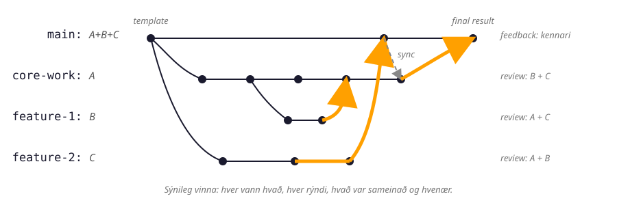

## Tillögur, rýni og samþætting

Pull requests (PRs) eru mikilvægur hluti af samvinnu í GitHub verkefnum. Gott PR ætti að vera skýrt og veita rýnum (reviewers) nauðsynlegan bakgrunn til að meta breytingarnar.

::: {.callout-tip icon="true"}
Góð kóðarýni snýst ekki aðeins um að leita að villum, heldur líka um að gera vinnuna
skýrari, rekjanlegri og auðveldari fyrir teymið að viðhalda.
:::

## Af hverju skiptir máli að skrifa góð PRs?

- **Sparar tíma rýna** – Lýsandi PR hjálpar öðrum að átta sig á breytingunum fljótt.
- **Betri endurgjöf** – Skýr PR gerir rýnum kleift að veita gagnlegri athugasemdir.
- **Skilvirkari samþætting** – Með góðum PR er auðveldara að sameina breytingarnar án ruglings.


## Reglur fyrir sameiningu í `main`

Í hópverkefninu er gert ráð fyrir að hópar vinni með **verndaða aðalgrein** (`main`) — það
er, `main` er læst þannig að ekki er hægt að ýta breytingum beint inn á hana, heldur fara
allar breytingar inn með pull request sem uppfyllir ákveðnar reglur.

Í GitHub eru þessar reglur stilltar sem *ruleset* undir stillingum geymslunnar. Til að hópar
þurfi ekki að setja hverja reglu handvirkt er til tilbúið
[ruleset-sniðmát](../../templates/github-ruleset-require-pr-review-main.json) sem má afrita
inn í eigin gagnageymslu:

1. Farið í **Settings → Rules → Rulesets** í geymslunni
   (`https://github.com/<owner>/<repo>/settings/rules`).
2. Veljið **Import a ruleset** og hlaðið upp `github-ruleset-require-pr-review-main.json`.
3. Yfirfarið reglurnar og virkjið (*enable*) settið.

Í mannamáli þýðir regluverkið:

- ekki má eyða `main` eða skrifa yfir Git-söguna með force push,
- breytingar fara inn í `main` með pull request,
- að minnsta kosti **tveir rýnar** þurfa að samþykkja PR-ið, og þeir mega ekki vera sá
  sem sendi breytinguna inn,
- ef ný commit bætast við eftir rýni þarf að rýna aftur,
- PR-ið þarf að vera **up to date** áður en það er sameinað,
- allar umræður í review threads þurfa að vera leystar áður en hægt er að merge-a.
- aðeins notendur með tiltekin réttindi geta samþykkt undantekningar frá reglunum.

Markmiðið er ekki að gera GitHub flóknara, heldur að tryggja að sameining í `main`
sé meðvituð ákvörðun hópsins.

::: {.callout-note title="Af hverju þetta skiptir máli fyrir verkefnastjóra"}
Í hópverkefninu eru teymin þriggja manna. Verkefnastjóri hverrar lotu,
sem þarf að geta staðið skil á vinnu hópsins í iTA, hefur því yfirleitt annaðhvort
verið **PR-höfundur** eða **PR-rýnir** á öllum greinum sem voru sameinaðar inn í `main`.

Ef verkefnastjóri hefur sinnt PR-rýninni nægilega vel ætti hann að vera vel kunnugur
verkefninu: hvað var gert, hver gerði hvað, hvers vegna breytingarnar voru samþykktar
make og hvernig þær tengjast hópverkefninu.
:::

Nokkur GitHub-hugtök sem birtast í þessu ferli:

- **Resolve conversation** þýðir að athugasemd eða umræða í PR hefur verið afgreidd.
  Ef rýnandi spyr spurningar eða biður um breytingu þarf höfundur að svara og laga eða
  útskýra málið. Þegar allir eru sáttir er conversation merkt sem leyst.
- **Stale approval** þýðir að samþykki rýnis er orðið úrelt. Það gerist þegar ný commit
  bætast við eftir að PR var samþykkt. Þá þarf að rýna breytinguna aftur, því kóðinn sem
  var samþykktur er ekki lengur nákvæmlega sami kóði og á að sameina.
- **Up to date** þýðir að branch-ið í PR inniheldur nýjustu breytingar úr `main`. Ef `main`
  hefur breyst síðan PR-ið var opnað þarf að uppfæra branch-ið áður en sameinað er.

## Hvað á PR að innihalda?

1. **Góða fyrirsögn** – Hún ætti að vera lýsandi og segja hvað PR-ið gerir.
   ```
   Bætir við tveggja þátta auðkenningu fyrir innskráningu
   ```

2. **Samantekt (Description)** – Útskýrir hvað var gert og hvers vegna.
   ```markdown
   ## Lýsing
   Þessi breyting bætir við tveggja þátta auðkenningu (2FA) með Google Authenticator.
   Notendur þurfa að slá inn kóða úr síma sínum þegar þeir skrá sig inn.
   ```

3. **Tengingar við issues** – Ef PR-ið leysir ákveðið issue, notaðu `Fixes #X`.
   ```markdown
   Fixes #42
   ```

4. **Hvernig prófa má breytingarnar** – Leiðbeiningar fyrir rýna um hvernig þeir geta prófað kóðann.
   ```markdown
   ## Prófanir
   1. Skráðu þig inn með notanda.
   2. Athugaðu hvort þú sért beðinn um 2FA kóða.
   3. Sláðu inn réttan kóða og staðfestu að innskráning virki.
   ```

5. **Skjáskot (ef við á)** – Ef breytingarnar hafa áhrif á UI, bættu við mynd.
   ```markdown
   
   ```

6. **Hvað þarf að athuga?** – Eru einhverjir aukahlutir sem þarf að skoða?
   ```markdown
   ## Athugasemdir
   - Þarfnast uppfærslu á skjölum
   - Ekki búið að skrifa prófanir fyrir 2FA ennþá
   ```

7. **Óskað eftir rýnendum** – Merktu viðeigandi aðila til að fara yfir kóðann.

## Gott PR vs. Slæmt PR

**Gott PR**
```markdown
## Lýsing
Bætir við virkni til að vista notendastillingar í gagnagrunni.

Fixes #12

## Prófanir
1. Opnaðu stillingasíðuna.
2. Breyttu notendanafni og vistaðu.
3. Athugaðu að breytingarnar eru skráðar í gagnagrunninn.
```

**PR sem ætti að forðast**
```markdown
Breytti einhverju í stillingum.
```

Skýr og skipulögð PR gera kóðarýni einfaldari og hjálpa teyminu að rekja ákvarðanir yfir tíma.

## Metanleg hegðun verður sýnileg

GitHub-vinnuflæðið er ekki bara tæknilegt formsatriði. Það gerir vinnuna sýnilega:
hver lagði til breytingu, hver rýndi hana, hvaða athugasemdir komu fram, hvernig höfundur
svaraði og hvenær hópurinn taldi breytinguna tilbúna til samþættingar.

::: {.visible-evidence-grid}
::: {.visible-evidence-card .practice}
### Nauðsynleg vinnubrögð

- afmörkuð PR með skýrum tilgangi
- að minnsta kosti tvær efnislegar rýnir
- skýr svör við öllum athugasemdum
- sameining aðeins eftir rýni
:::

::: {.visible-evidence-card .evidence}
### Sýnileg gögn um vinnuna

- höfundur og meðhöfundar breytinga
- dýpt gagnrýni — ekki bara `LGTM` eða 👍
- gæði afhendingar til næsta hópmeðlims
- uppfærð skjölun þegar breyting kallar á það
:::
:::

{fig-alt="Greinarit með main, core-work, feature-1 og feature-2 greinum. Nemendur A, B og C vinna á ólíkum greinum, rýna vinnu hvers annars og sameina breytingar með pull request eftir yfirferð."}

Heimild: Ingimundardóttir, H. (2026). *Using pull requests to make collaboration visible
in CDIO project-based courses*. Proceedings of the 22nd International CDIO Conference.
CDIO Initiative, Liverpool, United Kingdom. Sjá einnig
[*Assessable behaviors made visible*](https://tungufoss.github.io/CDIO-GitHub/#/assessable-behaviors-made-visible)
í CDIO-GitHub glærunum.
